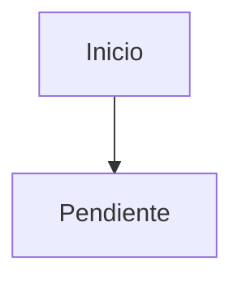

# Diagrama: Título Del Diagrama

## Resumen

Describe qué representa el diagrama y para qué debe usarse.

## Diagrama

## Descripción Textual

Explica el diagrama en texto para que pueda ser entendido por agentes aunque no rendericen Mermaid.

## Contextos Relacionados

- Pendiente.

## Decisiones Relacionadas

- Pendiente.

## Notas

- Pendiente.
